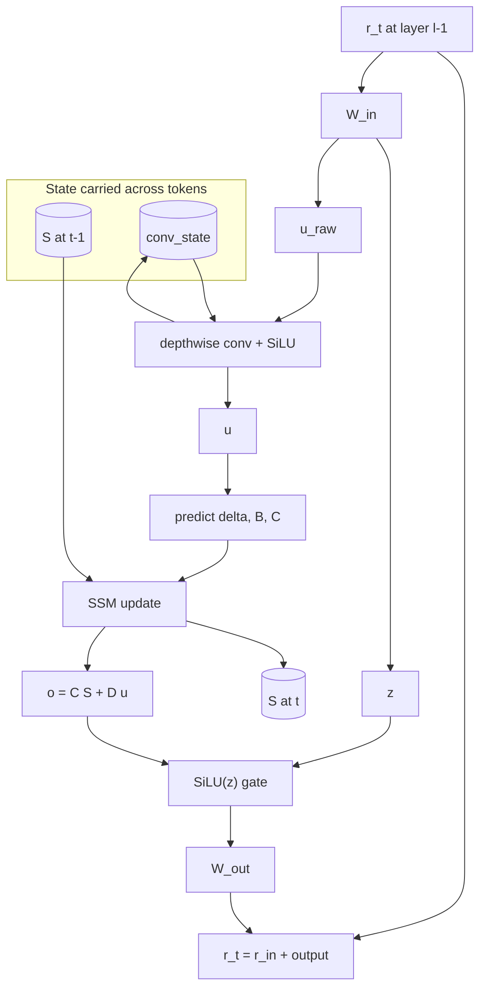

+++
title = "Representations of memory"
date = "2026-05-25T18:26:09-05:00"
toc = true

#
# description is optional
#
# description = "An optional description for SEO. If not provided, an automatically created summary will be used."

tags = []
+++

The transformer architecture has been KING for the past decade. Nobody has been able to beat it yet. There have been valiant attempts (MAMBAv1-3, SSMs, etc), but they have all failed to show their benefits at large scales. That being said, it is still useful to understand the tradeoffs of these techniques. Qwen3.5 and Kimi2.5 have incorporated recently "hybrid" architectures, mixing softmax attention with regular delta nets. Let's talk about this.  

### State space models

In continuous time, we often model state space models as the evolution of a latent/hidden state or system. It is represented as:
$$\frac{d h(t)}{dt} = f(h(t), x(t), t)$$
where $h(t)$ is the hidden state, $x(t)$ is the input, and $f$ is a function that defines the evolution of the hidden state.

For simplicity, we can restrict ourselves to the linear dynamical system scenario, where:
$$\frac{d h(t)}{dt} = A h(t) + B x(t)$$
$$y(t) = C h(t) + D x(t)$$

In the context of autoregressive modeling, we can think of the hidden state as the "memory", and the equation for $y(t)$ as the reading operation from memory. In this case, we actually have sort of a closed form solution for the hidden state, which we derive below.

**Lemma**: The solution to the linear dynamical system is given by:
$$h(t) = e^{At} h(0) + \int_0^t e^{A(t - s)} B x(s) ds$$

**Proof**: We can solve this by using the method of integrating factors. We have that:
$$\begin{align*}
\frac{d}{ds} (e^{-As} h(s)) &= -A e^{-As} h(s) + e^{-As} (A h(s) + B x(s)) \\
&= e^{-As} B x(s)
\end{align*}$$

Integrating both sides, we get:
$$\begin{align*}
\int_0^t \frac{d}{ds} (e^{-As} h(s)) ds &= \int_0^t e^{-As} B x(s) ds \\
e^{-At} h(t) - h(0) &= \int_0^t e^{-As} B x(s) ds \\
h(t) &= e^{At} h(0) + B \int_0^t e^{A(t - s)} x(s) ds
\end{align*}$$

This is the "sort-of" closed form solution for the hidden state. For systems with a dynamic $B(t)$, then we get:
$$h(t) = e^{At} h(0) + \int_0^t e^{A(t - s)} B(s) x(s) ds$$

However, what we actually observe in data is $x_1, x_2, \dots, x_t$ and we are concerned with the hidden state $h_1, h_2, \dots, h_t$. Our formula holds in a continuous regime. We can generalize our formula to the discrete regime by invoking the "zero-order hold" condition, which states that $x(t) = x_t$ for all $t \in [t_i, t_{i+1})$. This means that:

$$h_{t+\delta} = e^{A\delta}h(t) + \left(\int_t^{t+\delta} e^{A(t+\delta - r)} B(r) dr\right) x(t+\delta)$$

In a usual discrete dynamical system, we are given the system:
$$h_{t+1} = A_d h_t + B_d x_t$$
$$y_t = C_d h_t + D_d x_t$$

If we let $A_d = e^{A\delta}$ and $B_d = \int_t^{t+\delta} e^{A(t+\delta - r)} B(r) dr$, then we get exactly the discretized linear dynamical system.

#### Interlude for the matrix exponential

By the matrix exponential, I mean the symbol $e^{At}$. This is a special notation because the exponential function doesn't take matrix-valued inputs. But there is a very natural extension using the Taylor expansion:
$$e^{At} = I + At + \frac{(At)^2}{2!} + \frac{(At)^3}{3!} + \cdots$$

Now, let's look at analysis of the eigenvalue spectrum of $A$. Suppose that $A$ is diagonalizable, then $A = PDP^{-1}$ for some invertible matrix $P$ and diagonal matrix $D$. Then we have that:
$$e^{At} = P e^{Dt} P^{-1} = P \text{ diag}(e^{\lambda_1 t}, \dots, e^{\lambda_n t}) P^{-1}$$

It is easily to see that for the positive eigenvalues, this series will explode as $t \rightarrow \infty$. It is also to see that by differentiating the matrix exponential, we obtain that:
$$ \frac{d}{dt} e^{At} = A e^{At} = e^{At} A$$

This means that for the negative eigenvalued directions, the matrix exponential will completely remove those components from the expansion and only preserve the positive eigenvalued directions. 

### A model for memory

In regular transformers, we can represent the hidden state of a block as $H_t^l = (K_{1:t}^l, V_{1:t}^l)$. This is in other words known as the KV-cache (for better or worse). It allows us to retrieve facts or knowledge that the model has learned to represent at layer $l$. We are often given a query vector $q_t$, where $t$ denotes the time step (more accurately the $t$-th token in the sequence). For ordinary softmax attention, we obtain the new representation of the token via the operation:
$$o_t = \sum_{i=1}^t \text{softmax}\left(\frac{q_t k_i^T}{\sqrt{d_k}}\right)v_i$$

This is certainly one model for memory (and it is quite strong), but the memory cost of this is quite high. $K$ and $V$ are both $t \times d_k$ matrices, so the memory cost is $O(t d_k)$. This is quite expensive for long sequences. If we could somehow reduce the memory cost AND preserve the experimental performance of softmax attention, then that would be super ideal. 

#### Linear attention

We adopt the row-vector convention: $q_t, k_t \in \mathbb{R}^{1 \times d_k}$, $v_t, o_t \in \mathbb{R}^{1 \times d_v}$, and $S_t \in \mathbb{R}^{d_k \times d_v}$.

If we squint our eyes a little, we can see that softmax attention is merely retrieving value vectors from memory based on how similar the query is to the keys. But ultimately it is a convolution over the key vocabulary. In other words, as long as we can define a similarity metric, then we can perform something similar. One annoying part of the softmax attention is that we need to keep track of the entire $t \times t$ matrix (though it is usually not fully materialized). An ideal form of attention would be something like: 
$$o_t = \sum_{i=1}^t \phi(q_t) \phi(k_i)^T v_i$$
where $\phi$ is some kernel function. We can reduce **immensely** the computation load of attention if it is merely just a series of dot products. But kernel theory has been quite underwhelming as of late, so let's just use a regular identity kernel. We observe that our attention operation can be:
$$o_t = \sum_{i=1}^t q_t k_i^T v_i = q_t \sum_{i=1}^t k_i^T v_i$$
We see that the inner sum is a sum of outer products and that there exists a recurrent relation. Denote $S_n = \sum_{i=1}^n k_i^T v_i$, then we have that:
$$S_{n+1} = S_n + k_{n+1}^T v_{n+1}$$
We can write:
$$o_t = q_t S_t$$
$$S_t = S_{t-1} + k_t^T v_t$$
so $o_t = q_t S_{t-1} + q_t k_t^T v_t$.
In other words, it's the memory retrieved from the most recent step corrected by the $q_t k_t^T v_t$ term. Thus, per block layer, we can associate the $S_t^l$ as the hidden state for that layer.

#### RetNet

RetNet applies a very natural concept to linear attention. In the above, formulation we are unable to "forget" information that is no longer relevant or very far back from the current time step. RetNet solves this by applying a time-dependent decay factor $\alpha(t) \in (0, 1)$ to the memory update. This means that:
$$S_t = \alpha(t) S_{t-1} + k_t^T v_t$$

#### Gated linear attention

GLA aims to solve the same problem as RetNet but through a different lens. Instead of applying a blanket decay factor, we can train a gate that takes in the current token to determine coordinate-wise how much to decay and update the memory. This means the update is:
$$S_t = G \odot S_{t-1} + k_t^T v_t$$

This gate $G$ can be a parameter-valued matrix or a something that takes in the query vector $q_t$ to determine the gate, like a SwiGLU gate for example.

#### Delta nets

For delta nets, we can view the memory as a form of online regression, where our objective is to predict the value vector using $k_t$. Let's look at the update for linear attention again:
$$S_t = S_{t-1} + k_t^T v_t$$
Let's define $\hat{v}_t = k_t S_{t-1}$. We can view this as predicting $v_t$ from the current memory. Then we update via the prediction error:
$$S_t = S_{t-1} + \beta_t k_t^T(v_t - \hat{v}_t)$$ 
Equivalently, we have:
$$S_t = (I - \beta_t k_t^T k_t) S_{t-1} + \beta_t k_t^T v_t$$
where $\beta_t$ is a learned writing strength. The connection to online training is more evident if we see that at every time step, we obtain a pair of training examples $(k_t, v_t)$. We are trying to learn an association $S$ such that $k_t S \approx v_t$. At each step we minimize the instantaneous loss:
$$l_t(S) = \frac{1}{2} \|k_t S - v_t\|^2$$
The delta rule is online (stochastic) gradient descent on this loss, not full-batch gradient descent on the cumulative loss $\sum_{i=1}^t \|k_i S - v_i\|^2$. Taking the gradient at $S_{t-1}$:
$$\nabla_S l_t(S_{t-1}) = k_t^T (k_t S_{t-1} - v_t)$$
$$S_t = S_{t-1} - \beta_t \nabla_S l_t(S_{t-1}) = S_{t-1} + \beta_t k_t^T (v_t - k_t S_{t-1})$$
which is exactly the delta update rule. Another advantage of the DeltaNet compared to regular linear attention is that if the query is very similar to two keys, then their value vectors will clash. In particular for $k_i$ and $k_j$, if we have $q_t \cdot k_i \approx q_t \cdot k_j$, then $v_i$ and $v_j$ will clash. DeltaNet somewhat avoids this via the erase then write memory paradigm. 

#### Gated delta nets and generalized householder

The above formulation of the delta net which gives the update:
$$S_t = (I - \beta_t k_t^T k_t) S_{t-1} + \beta_t k_t^T v_t$$
can be viewed as a generalized householder transformation. In particular, we can write:
$$S_t = H_t S_{t-1} + \beta_t k_t^T v_t$$
where $H_t$ is a householder or projection matrix. We can generalize the concept of the gating to also the delta net as well with the update:
$$S_t = G \odot S_{t-1} + \beta_t k_t^T(v_t - k_t (G \odot S_{t-1}))$$

The erase and write operation need not be at the same strength level $\beta_t$. Decoupling them brings us Gated DeltaNet 2, giving us the update:
$$S_t = G \odot S_{t-1} - (w_{t_1} \odot k_t)^T k_t (G \odot S_{t-1}) + \beta_t k_t^T (w_{t_2} \odot v_t)$$

where $w_{t_1}$ is the key-sided learned gate and $w_{t_2}$ is the value-sided learned gate. We can also view a similar update rule as:
$$S_t = G \odot S_{t-1} + (w_{t_1} \odot k_t)^T (w_{t_2} \odot (v_t - k_t (G \odot S_{t-1})))$$

#### Kimi delta attention

This is a particular instantiation of the gated delta net where the gate is a diagonal matrix. In particular, we have $D_t = \text{diag}(\alpha_t)$. We can write the update as:
$$S_t = D_t \odot S_{t-1} + \beta_t k_t^T(v_t - k_t (D_t \odot S_{t-1}))$$
where $\odot$ is the Hadamard product.

### MAMBA

In the context of modeling language (but really any autoregressive sequence), we see a stream of "tokens" or "observations". In the deep learning framework, let's denote $r_t^l$ as the representation of the $t$-th token or observation at layer $l$ in the network. We can view the inference process proceeding as following:
$$r_t^0 \rightarrow r_t^1 \rightarrow r_t^2 \rightarrow \cdots \rightarrow r_t^L$$

For regular decoder transformers, the update roughly is:
$$r_t^l = r_t^{l-1} + \text{MLP}(\text{SelfAttention}(r_t^{l-1})) = r_t^{l-1} + f(r_t^{l-1})$$

which we can interpret for some function $f$. The memory for decoder transformers at layer $l$ at time $t$ is represented by $S_t^l = (K_{1:t}^l, V_{1:t}^l)$. We can think of the update learning a transition from:
$$(r_t^l, S_t^l) \leftarrow f_\theta(r_t^{l-1}, S_{t-1}^l)$$

This is essentially the same formulation the update rule for deep-RNNs/SSMs, as well as for the other attention variants above. As a refresher on the SSM update, by assuming the zero-hold condition, we have that:

$$h_t = A_d(\delta) h_{t-1} + B_d(\delta) x_t$$
$$y_t = C h_t + Dx_t$$

where $A_d(\delta) = e^{A \delta}$ and $B_d(\delta) = \int_t^{t+\delta} e^{A(t+\delta - r)} B(r) dr$. If we assume that $A$ and $B$ are constant, then after reparameterizing, we see that:
$$B_d(\delta) = \int_0^\delta e^{Au} B du = A^{-1}(e^{A\delta} - I)B$$

#### Variable step sizes

If we then introduce variable step sizes, namely $\delta_t$, then the above changes are only really:
$$A_d(\delta_t) = e^{A \delta_t}$$
$$B_d(\delta_t) = \int_0^{\delta_t} e^{Au} B du$$

We will often allow the $\delta, A, B$ to all be time-dependent, let's define:
$$\delta_t = f_\theta(x_t), \quad A_t = g_\theta(x_t), \quad B_t = h_\theta(x_t)$$
$$C_t = s_\theta(x_t), \quad D_t = t_\theta(x_t)$$

Then we have that:
$$A_d(\delta_t) = e^{A_t \delta_t}, \quad B_d(\delta_t) = \int_0^{\delta_t} e^{A_t u} B_t du, \quad C_t = s_\theta(x_t), \quad D_t = t_\theta(x_t)$$

#### MAMBA state

So how does MAMBA ever evolve its state? For a batch size $B_{\text{batch}}$, sequence length $L$, channel dimension $d_{\text{channel}}$, and SSM feature dimension $d_{\text{SSM}}$, we say that:
$$\texttt{ssm_state}_t^l = S_t^l \in \mathbb{R}^{B_{\text{batch}} \times d_{\text{channel}} \times d_{\text{SSM}}}$$
is the SSM state at time $t$ for layer $l$. We can think of MAMBA running multiple SSMs in parallel for each channel and for each layer in the network.

**What is the channel? What is the SSM dimension?** I've thought about this and the best way I can explain it is that for MAMBA since we run multiple SSMs (meaning the evolution process described above), we can think of the channel as a "nominal" dimension and the "SSM dimension" as the features for that "nominal" dimension. That means if we per layer, since we have $d_{\text{channel}}$ channels, we will have $d_{\text{channel}}$ SSMs running in parallel where the hidden vector $h_t^l \in \mathbb{R}^{d_{\text{SSM}}}$. Now that this is cleared up, below is the MAMBA block:

#### MAMBA block

Fix layer $l$ and token $t$. Mamba keeps two fixed-size states: short memory $\texttt{conv_state}^{(l)}$ (local context) and long memory $S^{(l)}$ (selective SSM). One decoder step:

$$[u_{t,\text{raw}},\, z_t] = r_{t}^{(l-1)} W_{\text{in}}$$

$$u_t = \mathrm{SiLU}\left( \mathrm{DepthwiseConv}\left( \mathrm{shift}(\texttt{conv\_state}_{t-1},\, u_{t,\text{raw}}) \right) \right)$$

$$\delta_t = f_\theta(u_t),\quad B_t = h_\theta(u_t),\quad C_t = s_\theta(u_t)$$

$$S_t = A_d(\delta_t)\, S_{t-1} + B_d(\delta_t)\, u_t$$

$$o_t = C_t S_t + D_t u_t$$

$$\tilde{o}_t = \mathrm{SiLU}(z_t) \odot o_t$$

$$r_t^{(l)} = r_{t}^{(l-1)} + W_{\text{out}} \tilde{o}_t$$

Compared to a transformer block, the KV cache is replaced by $\texttt{conv_state}$ and $S_t$, both bounded in size.

### FAQs

**What is $A_t^l$ if at every layer we run $d_{\text{channel}}$ SSMs?**

Per layer, we fit a $A_t^l \in \mathbb{R}^{d_{\text{channel}} \times d_{\text{SSM}}}$ matrix. It is token dependent. That means **per** SSM, the actually "A" matrix is just a diagonal matrix. The per channel recurrence is:
$$S_t^l[j, :] = e^{\delta_t \text{diag}(A_t^l[j, :])} \odot S_{t-1}^l[j, :] + \left( \frac{e^{\delta_t \text{diag}(A_t^l[j, :])} - 1}{A_t^l[j, :]} \odot B_t^l[j, :] \right) u_t[j]$$
with memory readout:
$$y_t^l[j] = C_t^l[j, :] \cdot S_t^l[j, :] + D_t^l[j] u_t[j]$$

**What about the $B_t^l$ update? And the rest of the SSM update?**

Keep in mind that $u_t[j] \in \mathbb{R}$, so that means that $B_t^l[j, :] u_t[j] \in \mathbb{R}^{d_{\text{SSM}}}$. This means the dimensions match up. We can view the operation $B_t^l[j, :] u_t[j]$ as "write"-operation, similar to the above. By similar extensions, we see that $B_t^l \in \mathbb{R}^{d_{\text{channel}} \times d_{\text{SSM}}}$. This way the dimensions add up. 
